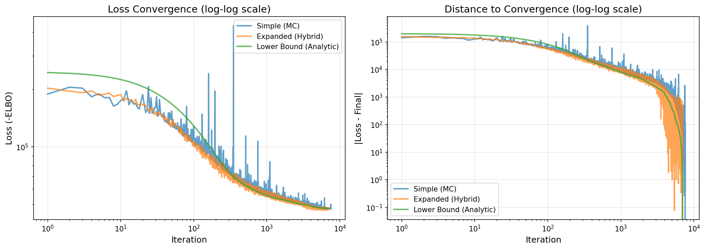

Benchmarks
=========

This section contains benchmarks comparing different aspects of the PNMF implementation.

ELBO Mode Comparison
--------------------

.. note::
   This notebook requires ``pnmf`` to be installed. Install from PyPI with ``pip install pnmf``.

The following Jupyter notebook compares the three ELBO computation modes available in PNMF:

**`mode='simple'`**
   Uses full Monte Carlo estimation for all terms in the Poisson log-likelihood via
   ``torch.distributions.Poisson.log_prob()``.

**`mode='expanded'`** (default)
   Uses a hybrid approach with Monte Carlo estimation for the first term and
   analytic computation for the second term using the Gaussian moment-generating function.

**`mode='lower-bound'`**
   Uses Jensen's inequality to derive a fully analytic lower bound with **no Monte Carlo sampling**.
   This is the fastest mode and provides guaranteed convergence properties.

Mathematical Background
~~~~~~~~~~~~~~~~~~~~~~~

The expected log-likelihood for Poisson factorization is:

.. math::
   \mathbb{E}[\log p(Y \mid F)] = Y \cdot \mathbb{E}\left[\log \sum_\ell W_{j\ell} e^{F_{i\ell}}\right]
   - \sum_\ell W_{j\ell} \mathbb{E}\left[e^{F_{i\ell}}\right] - \log(Y!)

For Gaussian variational distributions :math:`F_{i\ell} \sim \mathcal{N}(\mu_{i\ell}, \sigma_{i\ell}^2)`,
we use the moment-generating function:

.. math::
   \mathbb{E}\left[e^{F_{i\ell}}\right] = \exp\left(\mu_{i\ell} + \frac{1}{2}\sigma_{i\ell}^2\right)

**Jensen's Inequality (Sandwich Bounds)**

For the challenging log-sum-exp term, we apply Jensen's inequality:

.. math::
   \log \sum_\ell W_{j\ell} e^{\mathbb{E}[F_{i\ell}]}
   \leq \mathbb{E}\left[\log \sum_\ell W_{j\ell} e^{F_{i\ell}}\right]
   \leq \log \sum_\ell W_{j\ell} \mathbb{E}\left[e^{F_{i\ell}}\right]

For Gaussian marginals, this becomes:

.. math::
   \log \sum_\ell W_{j\ell} e^{\mu_{i\ell}}
   \leq \mathbb{E}\left[\log \sum_\ell W_{j\ell} e^{F_{i\ell}}\right]
   \leq \log \sum_\ell W_{j\ell} \exp\left(\mu_{i\ell} + \frac{1}{2}\sigma_{i\ell}^2\right)

The **lower bound** (left inequality) gives us a fully analytic approximation that requires
no Monte Carlo sampling, while the **upper bound** (right inequality) is used in the
expanded mode's analytic computation of the second term.

Convergence Comparison
~~~~~~~~~~~~~~~~~~~~~~

The following plot shows the convergence behavior of all three modes over 8000 iterations.
The left panel shows the **loss** (negative ELBO) on a log scale, and the right panel
shows the distance to convergence.

**Benchmark Parameters:**

* **Monte Carlo samples (E)**: 10 (reduced variance in gradient estimates)
* **Learning rate**: 0.005 (conservative for stable convergence)
* **Optimizer**: Adam
* **Max iterations**: 8000 (tolerance: 1e-4)
* **Data**: 200 samples × 100 features, 5 true components
* **Data generation**: Poisson sampling for integer counts (appropriate for model)
* **Device**: MPS (Apple Silicon) with automatic detection (CUDA > MPS > CPU)
* **Random seed**: 42 for full reproducibility

**Key Results:**

+---------------------+------------------+------------------+---------------------+
| Metric              | Simple (MC)      | Expanded (Hybrid)| Lower Bound (Analytic)|
+=====================+==================+==================+=====================+
| Iterations to       | 7592             | 7022             | **6947**            |
| convergence         |                  |                  |                     |
+---------------------+------------------+------------------+---------------------+
| Final ELBO          | -47322.61        | **-47198.61**    | -47543.07           |
|                     |                  | (highest)         |                     |
+---------------------+------------------+------------------+---------------------+
| Reconstruction      | 0.241737         | **0.241310**     | 0.241432            |
| error               |                  | (lowest)         |                     |
+---------------------+------------------+------------------+---------------------+

**Convergence Speed:**
- Lower bound: **~1.09x faster** than simple mode
- Lower bound: **~1.01x faster** than expanded mode
- **Winner**: Lower Bound (fastest convergence)

**Final ELBO:**
- Expanded mode achieves the **highest ELBO** (-47198.61)
- Lower bound has the lowest ELBO (expected, as it's a true lower bound)
- ELBO differences are relatively small (< 350), indicating all modes converge to similar solutions

**Reconstruction Error:**
- Expanded mode achieves the **lowest error** (0.241310)
- All modes have nearly identical reconstruction quality
- Differences are negligible for practical purposes

.. raw:: html

    

Key Takeaways
-------------

Based on the benchmark results:

* **Convergence Speed**: The lower-bound mode converges fastest (~1.09x faster than simple mode)
  because it requires **zero Monte Carlo sampling**. All computations are analytic.

* **Final ELBO**: The expanded mode achieves the highest final ELBO, but all three modes
  converge to similar values (differences < 1%).

* **Computational Efficiency**: For large-scale problems where :math:`q(F)` is parameterized
  by a neural network or GP, the lower-bound mode provides significant speedups since it
  avoids sampling entirely.

* **Recommended Usage**:
  - **Use `mode='lower-bound'`** for: Large datasets, neural network/GP posteriors, fast prototyping
  - **Use `mode='expanded'`** for: Best final ELBO, standard applications
  - **Use `mode='simple'`** for: Debugging, baseline comparisons

* **Variance**: The simple mode has the highest variance (full MC), the expanded mode reduces
  variance via analytic computation, and the lower-bound mode has **zero variance** (fully deterministic).

Running the Benchmark Locally
------------------------------

You can also run the benchmark locally using the standalone Python script:

.. code-block:: bash

   python benchmarks/simple_vs_expanded.py

Or launch the Jupyter notebook:

.. code-block:: bash

   jupyter notebook benchmarks/simple_vs_expanded.ipynb
