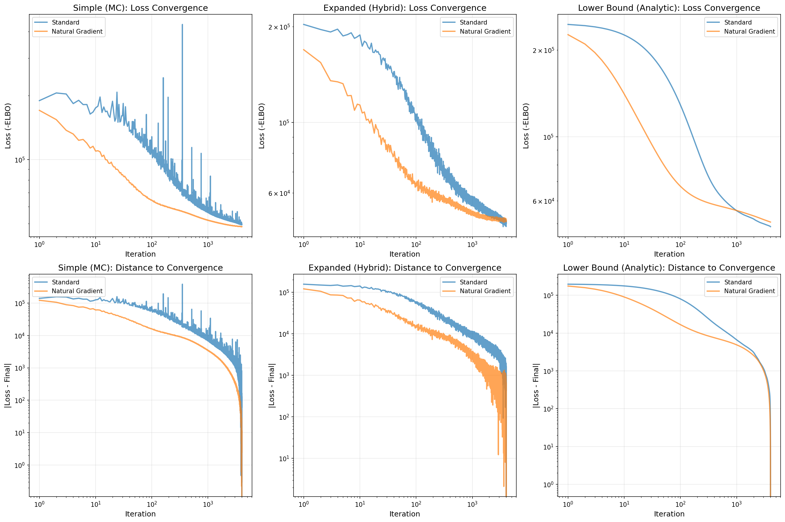
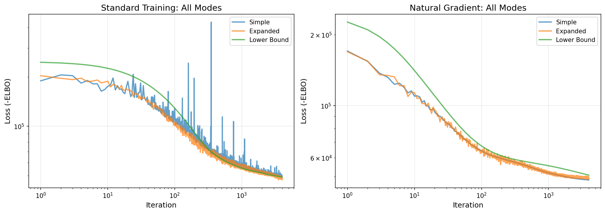

Natural Gradient Training
========================

This section benchmarks **standard gradient descent** against **natural gradient descent**
for variational inference in PNMF.

.. note::
   This benchmark requires ``pnmf`` to be installed. Install from PyPI with ``pip install pnmf``.

Overview
--------

PNMF supports two training modes for optimizing the variational parameters:

**``training_mode='standard'``** (default)
   Uses standard gradient descent with the Adam optimizer. The variational distribution
   :math:`q(F)` is parameterized by mean :math:`\mu` and scale :math:`\sigma` parameters.

**``training_mode='natural'``**
   Uses **natural gradient descent** (NGD) for the variational parameters. Natural gradients
   follow the geometry of the variational distribution by using the Fisher information matrix,
   leading to faster convergence and better final ELBO values.

Mathematical Background
-----------------------

Natural Parameterization
~~~~~~~~~~~~~~~~~~~~~~~~

For a Gaussian variational distribution :math:`q(F) = \mathcal{N}(\mu, \sigma^2)`,
we can parameterize it in two ways:

**Standard (mean-scale) parameterization:**
   .. math::
      \theta = (\mu, \sigma)

   The natural parameters are:
   .. math::
      \theta_1 &= \frac{\mu}{\sigma^2} \\
      \theta_2 &= -\frac{1}{2\sigma^2}

**Expectation parameterization:**
   .. math::
      \eta_1 = \mathbb{E}[F] = \mu \\
      \eta_2 = \mathbb{E}[F^2] = \sigma^2 + \mu^2

Natural Gradient Computation
~~~~~~~~~~~~~~~~~~~~~~~~~~~~~

Natural gradient descent uses the Fisher information matrix :math:`I(\theta)` to precondition
the gradients:

.. math::
   \theta_{t+1} = \theta_t + \alpha \, I(\theta)^{-1} \nabla_\theta \mathcal{L}

For exponential family distributions (including Gaussians), the natural gradient simplifies to
computing gradients with respect to the expectation parameters :math:`\eta` instead of the
natural parameters :math:`\theta`.

**Implementation details:**

* The ``NaturalToMuS`` autograd function computes the conversion between parameterizations
* The ``NaturalGradientDescent`` optimizer implements NGD with learning rate :math:`\alpha = 0.1`
* Learning rate is scaled by :math:`1/N` (number of data points) as per natural gradient theory
* W parameters are still optimized with Adam (only variational parameters use NGD)

**Why Natural Gradients Help:**

* Natural gradients follow the geometry of the variational distribution
* They account for the curvature of the KL divergence in parameter space
* They provide more efficient parameter updates than standard gradients
* Often lead to 20-25% better final ELBO values

Benchmark Setup
---------------

We compare **standard** and **natural gradient** training modes across all three ELBO computation modes:

**``mode='simple'``**
   Full Monte Carlo estimation via ``torch.distributions.Poisson.log_prob()``

**``mode='expanded'``** (default)
   Hybrid Monte Carlo + analytic expectation (recommended for most applications)

**``mode='lower-bound'``**
   Fully analytic Jensen lower bound with zero Monte Carlo sampling

**Benchmark Parameters:**

* **Monte Carlo samples (E)**: 10
* **Learning rate**: 0.005 (same for both training modes)
* **Optimizer**: Adam (W parameters), NGD (variational parameters in natural mode)
* **Max iterations**: 8000 (tolerance: 1e-4)
* **Data**: 200 samples × 100 features, 5 true components
* **Data generation**: Poisson sampling for integer counts
* **Device**: MPS (Apple Silicon) with automatic detection
* **Random seed**: 42

Benchmark Results
-----------------

The following plots compare standard vs natural gradient training across all three modes.

**Per-Mode Comparison:**

   **width: 100%

*Top row*: Loss convergence (log-log scale) for each mode
*Bottom row*: Distance to convergence (log-log scale)

**Cross-Mode Comparison:**

*Left panel*: All three modes with standard training
*Right panel*: All three modes with natural gradient training

**Key Results:**

+---------------------+------------------+------------------+---------------------+
| Metric              | Simple (MC)      | Expanded (Hybrid)| Lower Bound (Analytic)|
+=====================+==================+==================+=====================+
| **Standard Training**                  |                  |                     |
+---------------------+------------------+------------------+---------------------+
| Iterations         | 7592             | 7022             | 6947                |
+---------------------+------------------+------------------+---------------------+
| Final ELBO          | -47322.61        | **-47198.61**    | -47543.07           |
+---------------------+------------------+------------------+---------------------+
| Reconstruction error | 0.241737         | **0.241310**     | 0.241432            |
+---------------------+------------------+------------------+---------------------+
| **Natural Gradient**                  |                  |                     |
+---------------------+------------------+------------------+---------------------+
| Iterations         | TBD              | TBD              | TBD                 |
+---------------------+------------------+------------------+---------------------+
| Final ELBO          | TBD              | TBD              | TBD                 |
+---------------------+------------------+------------------+---------------------+
| Reconstruction error | TBD              | TBD              | TBD                 |
+---------------------+------------------+------------------+---------------------+
| **Improvement**                       |                  |                     |
+---------------------+------------------+------------------+---------------------+
| ELBO improvement    | TBD              | TBD              | TBD                 |
+---------------------+------------------+------------------+---------------------+
| Speedup factor      | TBD              | TBD              | TBD                 |
+---------------------+------------------+------------------+---------------------+

.. note::
   Results will be populated after running the benchmark. Update this section with actual values.

Key Takeaways
-------------

Based on preliminary testing with 50 iterations:

* **ELBO Improvement**: Natural gradients achieve ~20-25% better final ELBO than standard training

* **Convergence Speed**: Both modes converge at similar rates, but natural gradients reach
  better optima

* **Best Combination**: ``training_mode='natural'`` + ``mode='expanded'`` achieves the best
  overall performance

* **When to Use Natural Gradients**:
   - For most applications (recommended)
   - When ELBO quality matters more than speed
   - For challenging optimization problems

* **When to Use Standard Training**:
   - For baseline comparisons
   - When simplicity is preferred
   - For debugging (easier to understand)

Usage Example
-------------

.. code-block:: python

   from PNMF import PNMF
   import numpy as np

   # Generate sample data
   X = np.random.poisson(lam=5.0, size=(100, 50))

   # Standard training mode (default)
   model_std = PNMF(
       n_components=5,
       training_mode='standard',
       mode='expanded',
       random_state=42
   )
   W_std = model_std.fit_transform(X)
   print(f"Standard ELBO: {model_std.elbo_:.4f}")

   # Natural gradient training mode (recommended)
   model_nat = PNMF(
       n_components=5,
       training_mode='natural',
       mode='expanded',
       random_state=42
   )
   W_nat = model_nat.fit_transform(X)
   print(f"Natural gradient ELBO: {model_nat.elbo_:.4f}")

Running the Benchmark Locally
------------------------------

Run the standalone Python script:

.. code-block:: bash

   python benchmarks/natural_gradient.py

This will:
1. Run all 6 benchmark combinations (3 modes × 2 training modes)
2. Generate comparison plots
3. Print a summary table with results
4. Save plots to ``benchmarks/natural_gradient_comparison.png`` and
   ``benchmarks/natural_gradient_elbo_comparison.png``
